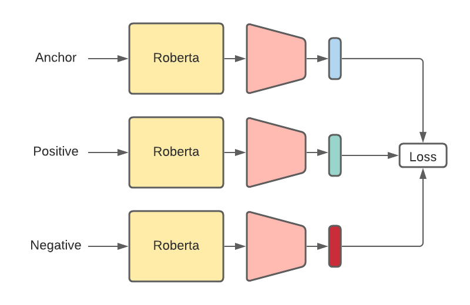

## Sentence Matching with BERT-based and triplet loss



### Installation
    pip install -r requirement.txt

### Usage

**Train**
```
python train_single.py --epochs 50 --batch_size 128 --clip 1.0 --lr 1e-3 --embed_dim 300 \
 --freeze False --space_joiner True --dropout 0.2 \
 --loss_fn triplet --max_len 30 \
 --PRE_TRAINED_MODEL_NAME 'emilyalsentzer/Bio_ClinicalBERT' \
 --model_path './ckpt/best_model_v6_triplet' \
 --train_dir './data/14k_data.csv' \
 --use_aux True --use_aug_data True
```

**TestDB**
```
python evaluate_single.py --embed_dim 300 \
 --freeze False --space_joiner True --dropout 0.2 \
 --loss_fn triplet --max_len 30 \
 --PRE_TRAINED_MODEL_NAME 'emilyalsentzer/Bio_ClinicalBERT' \
 --model_path './ckpt/best_model_v6_triplet' \
 --train_dir './data/100k_data.csv'
```

**Inference**
```
python inference.py --embed_dim 300 \
 --PRE_TRAINED_MODEL_NAME 'emilyalsentzer/Bio_ClinicalBERT' \
 --model_path './ckpt/best_model_v6_triplet' \
```


Checkpoint dir :https://drive.google.com/drive/u/0/folders/1mC4SHnhnEYaNgzi7Ng_6YhIRgO9zp9mP

TODO  
Train MLM 